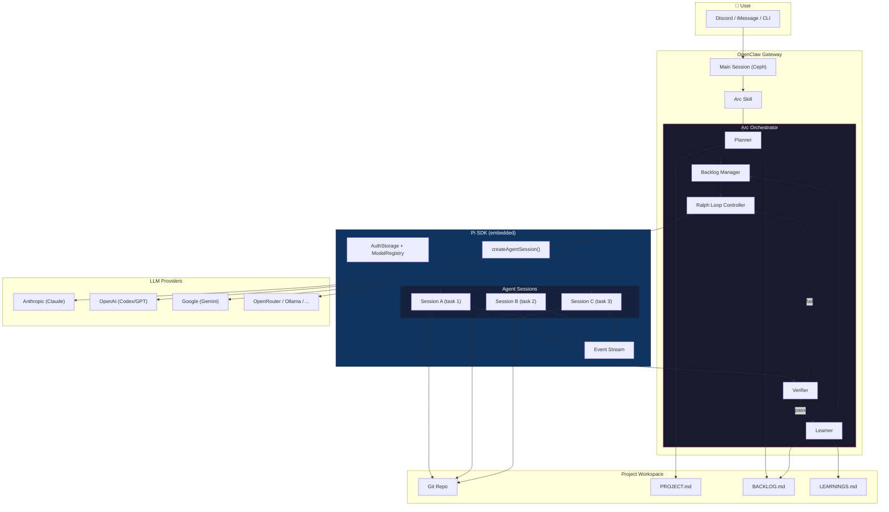
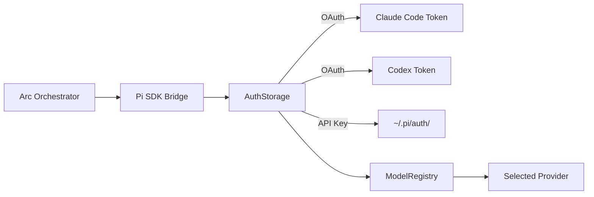
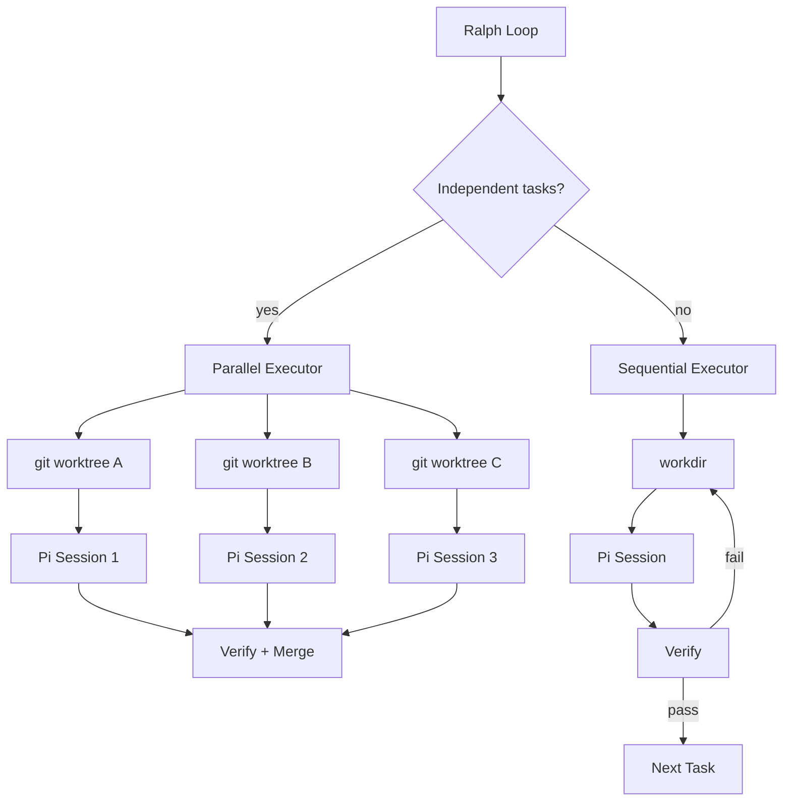
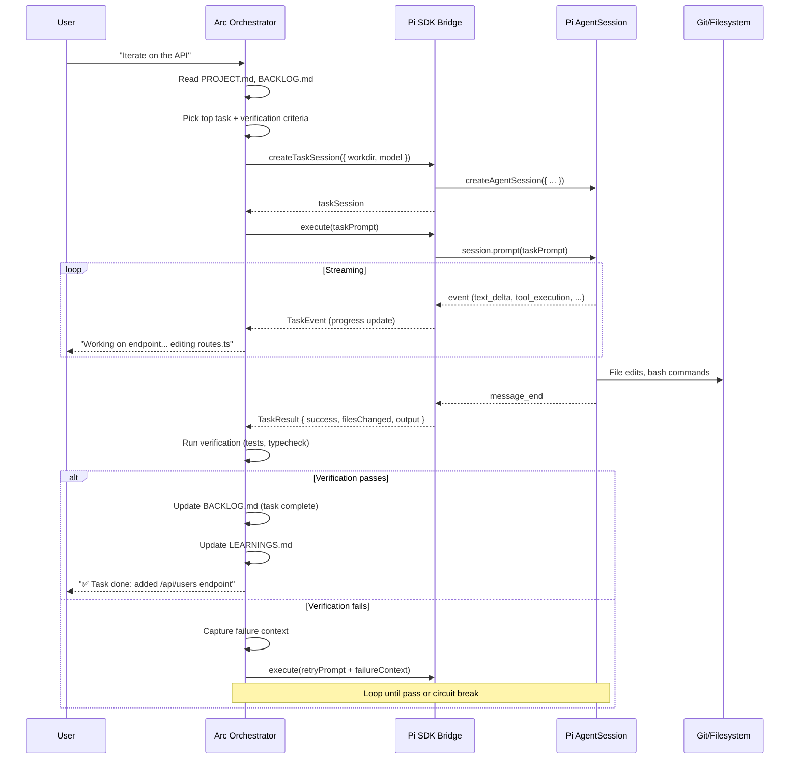

# Arc Architecture — Option B: OpenClaw + Pi SDK

*Spec v0.1 — 2026-02-16*

## Overview

Arc is the **coding orchestrator** for Point Labs. It lives inside OpenClaw as an extension/skill and uses **Pi's SDK** programmatically to execute coding tasks — replacing raw PTY spawning with structured, event-driven agent sessions.

OpenClaw handles the **what** (task planning, backlog, verification, learning). Pi handles the **how** (LLM interaction, tool execution, file editing, bash).

## Architecture Diagram



## Component Breakdown

### 1. Arc Skill (OpenClaw layer)

Lives at `skills/arc/` in OpenClaw. Activated when Peter says "let's iterate" or explicitly invokes Arc.

**Responsibilities:**
- Parse PROJECT.md, BACKLOG.md, LEARNINGS.md
- Plan tasks and prioritize
- Decide sequential vs parallel execution
- Verify task completion
- Capture learnings
- Report progress to user

**Does NOT:** Write code, run bash, edit files in the project. That's Pi's job.

### 2. Arc Orchestrator (the brain)

```
┌─────────────────────────────────────────────┐
│                 Arc Orchestrator              │
│                                               │
│  ┌──────────┐  ┌──────────┐  ┌────────────┐ │
│  │ Planner  │→│ Loop Ctrl │→│  Verifier   │ │
│  └──────────┘  └──────────┘  └────────────┘ │
│       ↕              ↕              ↕         │
│  ┌──────────┐  ┌──────────┐  ┌────────────┐ │
│  │ Backlog  │  │ Pi SDK   │  │  Learner   │ │
│  │ Manager  │  │ Bridge   │  │            │ │
│  └──────────┘  └──────────┘  └────────────┘ │
└─────────────────────────────────────────────┘
```

**Planner** — Reads project files, generates tasks with verification criteria.

**Backlog Manager** — CRUD on BACKLOG.md. Tracks task status, priorities, dependencies.

**Loop Controller (Ralph Loop)** — The iteration engine:
```
pick task → create Pi session → prompt → stream events → verify → learn → repeat
```

**Verifier** — Runs verification commands (tests, type-check, lint) and evaluates results against task criteria.

**Learner** — Extracts insights from successes/failures, updates LEARNINGS.md, feeds context back into future tasks.

### 3. Pi SDK Bridge

The integration layer between Arc and Pi's SDK.

```typescript
import {
  AuthStorage,
  createAgentSession,
  ModelRegistry,
  SessionManager,
} from "@mariozechner/pi-coding-agent";

interface ArcPiBridge {
  // Create a fresh session for a task
  createTaskSession(options: {
    workdir: string;
    model?: string;
    agentsMd?: string;       // injected project context
    extensions?: string[];    // Pi extensions to load
  }): Promise<TaskSession>;
}

interface TaskSession {
  // Execute a task prompt, returns structured result
  execute(prompt: string): Promise<TaskResult>;
  
  // Steer mid-execution
  steer(instruction: string): Promise<void>;
  
  // Stream events for progress monitoring
  onEvent(handler: (event: TaskEvent) => void): void;
  
  // Clean up
  dispose(): void;
}

interface TaskResult {
  success: boolean;
  filesChanged: string[];
  output: string;            // structured, not raw terminal text
  tokensUsed: number;
  model: string;
  duration: number;
}
```

**Key advantage over PTY:** Structured `TaskResult` instead of parsing terminal output. Events for real-time progress. Clean session lifecycle.

### 4. Auth Flow

Pi's `AuthStorage` + `ModelRegistry` handle provider auth. Arc doesn't touch tokens directly.



Pi already supports Claude Code OAuth and Codex OAuth — Arc gets this for free through the SDK. No custom auth code needed.

### 5. Parallel Execution



Each parallel task gets:
- Its own **git worktree** (file isolation)
- Its own **Pi AgentSession** (context isolation)
- Its own **event stream** (independent monitoring)

Arc monitors all streams, merges results, handles conflicts.

## Data Flow: Single Task Lifecycle



## File Structure

```
skills/arc/
├── SKILL.md              # OpenClaw skill definition
├── src/
│   ├── index.ts          # Skill entry point
│   ├── orchestrator.ts   # Arc core logic
│   ├── planner.ts        # Task planning
│   ├── backlog.ts        # BACKLOG.md parser/writer
│   ├── verifier.ts       # Verification engine
│   ├── learner.ts        # Learning extraction
│   ├── loop.ts           # Ralph loop controller
│   └── bridge/
│       ├── pi-bridge.ts  # Pi SDK integration
│       ├── session.ts    # TaskSession wrapper
│       └── events.ts     # Event mapping
├── extensions/
│   └── arc-context.ts    # Pi extension: injects project context
└── templates/
    └── task-prompt.md    # Prompt template for coding tasks
```

## Configuration

```yaml
# arc.config.yaml (per-project)
model: claude-sonnet-4-20250514       # default model for coding tasks
thinkingLevel: medium
maxRetries: 3                    # circuit breaker per task
maxParallel: 3                   # concurrent Pi sessions
verification:
  commands:
    - "npm run typecheck"
    - "npm run test"
    - "npm run lint"
  timeout: 60                    # seconds per verification
auth:
  prefer: oauth                  # oauth | apikey
  provider: anthropic            # default provider
```

## Why This Over PTY Spawning

| Aspect | PTY (current) | Pi SDK (Option B) |
|--------|--------------|-------------------|
| Output | Raw terminal text, ANSI codes | Structured events + typed results |
| Control | `process:write` / `send-keys` | `session.steer()` / `session.followUp()` |
| Lifecycle | Kill PID, hope for the best | `session.dispose()`, clean shutdown |
| Progress | Parse terminal output | Event stream with typed events |
| Auth | Separate per-agent | Unified via Pi's AuthStorage |
| Models | Fixed per agent | Switch mid-session, cycle providers |
| Context | AGENTS.md only | Extensions can inject dynamic context |
| Parallel | Multiple PTY processes | Multiple AgentSessions, same process |
| Error handling | Exit codes + output parsing | Structured error events |

## Open Questions

1. **Where does Arc live?** OpenClaw skill? Standalone package? Both?
2. **Pi extension vs pure SDK?** Should Arc also ship a Pi extension for standalone use (Option A hybrid)?
3. **Session persistence** — In-memory sessions (fresh per task) or file-backed (resume on crash)?
4. **Model selection** — Should Arc pick the model per-task based on complexity? (e.g., Haiku for lint fixes, Opus for architecture)
5. **OAuth token sharing** — Pi can use CC/Codex OAuth tokens. Should we auto-discover them or require explicit config?

---

*Next steps: Validate this spec, then start with a minimal loop — one task, one Pi session, verify, learn.*
